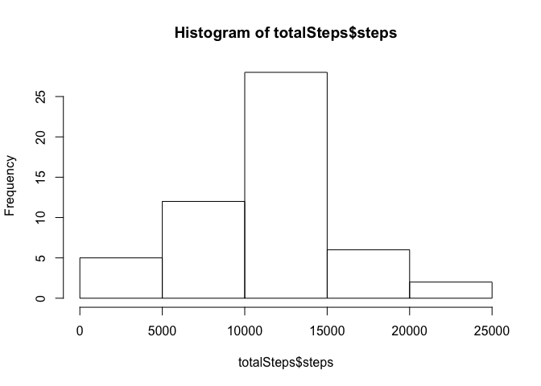
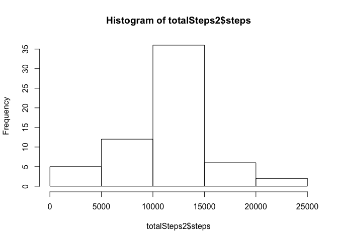

# Reproducible Research: Peer Assessment 1


## Loading and preprocessing the data

1. Load the csv data


```r
activity = read.csv("activity.csv")
```

2. Process/transform the data (if necessary) into a format suitable for analysis


```r
totalSteps <- aggregate(steps ~ date, data = activity, sum, na.rm = TRUE)
```

## What is mean total number of steps taken per day?

1. Make a histogram of the total number of steps taken each day


```r
hist(totalSteps$steps)
```

 

2. Calculate and report the **mean** and **median** total number of steps taken per day


```r
mean1 <- mean(totalSteps$steps)
mean1
```

```
## [1] 10766.19
```


```r
median1 <- median(totalSteps$steps)
median1
```

```
## [1] 10765
```


* The mean of steps per day is 1.0766189\times 10^{4} steps.
* The median of steps per day is 10765 steps.

## What is the average daily activity pattern?

1. Make a time series plot (i.e. `type = "l"`) of the 5-minute interval (x-axis) and the average number of steps taken, averaged across all days (y-axis)


```r
stepsInterval <- aggregate(steps ~ interval, data = activity, mean, na.rm = TRUE)
plot(steps ~ interval, data = stepsInterval, type = "l")
```

 

2. Which 5-minute interval, on average across all the days in the dataset, contains the maximum number of steps?


```r
intervalCount <- stepsInterval[which.max(stepsInterval$steps), ]$interval
intervalCount
```

```
## [1] 835
```

There is **835** intervals.

## Imputing missing values

1. Calculate and report the total number of missing values in the dataset (i.e. the total number of rows with `NA`s)


```r
missingCount <- sum(is.na(activity$steps))
missingCount
```

```
## [1] 2304
```

Total **2304** rows are missing.

2. Devise a strategy for filling in all of the missing values in the dataset. The strategy does not need to be sophisticated. For example, you could use the mean/median for that day, or the mean for that 5-minute interval, etc.

Create a helper function **"interval2steps"** to get the mean steps for particular 5-minute interval. 


```r
interval2steps <- function(interval) {
    stepsInterval[stepsInterval$interval == interval, ]$steps
}
```

3. Create a new dataset that is equal to the original dataset but with the missing data filled in.


```r
activityFilled <- activity
naCount = 0 
for (i in 1:nrow(activityFilled)) {
    if (is.na(activityFilled[i, ]$steps)) {
        activityFilled[i, ]$steps <- interval2steps(activityFilled[i, ]$interval)
        naCount = naCount + 1
    }
}

naCount
```

```
## [1] 2304
```

Total **2304** NA values were filled.

4. Make a histogram of the total number of steps taken each day and Calculate and report the **mean** and **median** total number of steps taken per day. Do these values differ from the estimates from the first part of the assignment? What is the impact of imputing missing data on the estimates of the total daily number of steps?


```r
totalSteps2 <- aggregate(steps ~ date, data = activityFilled, sum)
hist(totalSteps2$steps)
```

 


```r
mean2 <- mean(totalSteps2$steps)
mean2
```

```
## [1] 10766.19
```


```r
median2 <- median(totalSteps2$steps)
median2
```

```
## [1] 10766.19
```

* The **mean** total number of steps taken per day is 1.0766189\times 10^{4} steps.
* The **median** total number of steps taken per day is 1.0766189\times 10^{4} steps.
* The **mean** value is the **same** as the value before imputing missing data because we put the mean value for that particular 5-min interval. 
* The **median** value shows **a slightly** difference, but it depends on **where the missing values are**.


## Are there differences in activity patterns between weekdays and weekends?

1. Create a new factor variable in the dataset with two levels -- "weekday" and "weekend" indicating whether a given date is a weekday or weekend day.


```r
activityFilled$day = ifelse(as.POSIXlt(as.Date(activityFilled$date))$wday%%6 == 0, "weekend", "weekday")
activityFilled$day = factor(activityFilled$day, levels = c("weekday", "weekend"))
```


2. Make a panel plot containing a time series plot (i.e. `type = "l"`) of the 5-minute interval (x-axis) and the average number of steps taken, averaged across all weekday days or weekend days (y-axis). The plot should look something like the following, which was created using **simulated data**:


```r
stepsInterval2 = aggregate(steps ~ interval + day, activityFilled, mean)
library(lattice)
xyplot(steps ~ interval | factor(day), data = stepsInterval2, aspect = 1/2, type = "l")
```

 
